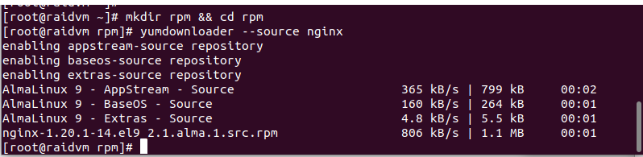
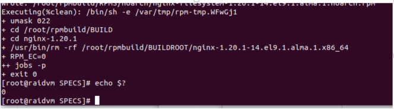
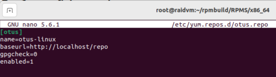

# homework-REPO

Описание домашнего задания
---
1. Создать свой RPM пакет
2. Реализовать это все либо в Vagrant, либо развернуть у себя через Nginx и дать ссылку на репозиторий

---
- Этап 1: Сначала вся работа была проделана "руками" внутри виртуальной машины. Но по условию требуется реализовать все в Vagrant, поэтому был написан ряд скриптов, которые вызываются из Vagrantfile, что делает возможным поднятие виртуалки и ее настройку (в рамках текущей задачи) одной командой.

Для выполнения этой части в Vagrantfile была добавлена строка
```bash
box.vm.synced_folder ".", "/home/pt/vagrant/repo"
```  
В этой директории лежат все скрипты, которые запускаются из секции "provision"
Все этапы разделены на разные скрипты, что позволяет быстрее вносить изменения (при необходимости), лучше заниматься отладной и использовать их для других целей, не выискивая строки среди общего кода

Так же в provision добавлены таймеры сна и сообщения о завершении конкретного этапа. Это дает время и возможность ознакомиться с результатом выполнения конкретного этапа настройки и найти этап, на котором может возникнуть ошибка

Все скрипты лежат в папке Scripts в этом репозитории

ОС для настройки: almalinux v9.3.20231118

Vagrant версии 2.4.1

VirtualBox версии 7.0.18


---

- Этап 2: Демонстрация выполнения задания внутри виртуалки в ручном режиме.

1. Создать свой RPM пакет

● Устанавливаем пакеты:
```bash
yum install -y wget rpmdevtools rpm-build createrepo \
 yum-utils cmake gcc git nano
```  


● Загружаем SRPM пакет Nginx:
```bash
mkdir rpm && cd rpm
yumdownloader --source nginx
```  


● Ставим все зависимости для сборки пакета Nginx:
```bash
rpm -Uvh nginx*.src.rpm
```


```bash
yum-builddep nginx
```


```bash
echo $?
```


● Скачиваем исходный код модуля ngx_brotli:
```bash
cd /root
git clone --recurse-submodules -j8 \
https://github.com/google/ngx_brotli
cd ngx_brotli/deps/brotli
mkdir out && cd out
```


● Собираем модуль ngx_brotli:
```bash
cmake -DCMAKE_BUILD_TYPE=Release -DBUILD_SHARED_LIBS=OFF -DCMAKE_C_FLAGS="-Ofast -m64 -march=native -mtune=native -flto -funroll-loops -ffunction-sections -fdata-sections -Wl,--gc-sections" -DCMAKE_CXX_FLAGS="-Ofast -m64 -march=native -mtune=native -flto -funroll-loops -ffunction-sections -fdata-sections -Wl,--gc-sections" -DCMAKE_INSTALL_PREFIX=./installed ..
```


```bash
cmake --build . --config Release -j 2 --target brotlienc
```


● Редактируем spec файл, чтобы Nginx собирался с необходимыми нам опциями:

```bash
nano /root/rpmbuild/SPECS/nginx.spec
```


● Сборка RPM пакета:

```bash
cd ~/rpmbuild/SPECS/
rpmbuild -ba nginx.spec -D 'debug_package %{nil}'
```


● Убедимся, что пакеты создались:

```bash
ll /root/rpmbuild/RPMS/x86_64/
```


● Копируем пакеты в общий каталог:
```bash
cp ~/rpmbuild/RPMS/noarch/* ~/rpmbuild/RPMS/x86_64/
cd ~/rpmbuild/RPMS/x86_64
```


● Устанавливаем пакет, проверяем nginx:

```bash
yum localinstall *.rpm
```


```bash
systemctl start nginx
systemctl status nginx
```


---

2. Создать свой репозиторий и разместить там ранее собранный RPM

● Создаем каталог repo и копируем туда наши собранные RPM-пакеты:

```bash
mkdir /usr/share/nginx/html/repo
cp ~/rpmbuild/RPMS/x86_64/*.rpm /usr/share/nginx/html/repo/
```


● Инициализируем репозиторий:
```bash
createrepo /usr/share/nginx/html/repo/
```


● Для прозрачности настроим в NGINX доступ к листингу каталога. 

```bash
# В файле в блоке server добавим следующие директивы
nano /etc/nginx/nginx.conf
# директивы
index index.html index.htm;
autoindex on;
```


● Проверяем синтаксис и перезапускаем NGINX:
```bash
nginx -t
nginx -s reload
```


● Проверяем курлом:

```bash
curl -a http://localhost/repo/
```


● Проверяем в браузере:

```bash
http://192.168.56.101/repo/
```


● Добавим репозиторий в /etc/yum.repos.d:
```bash
cat >> /etc/yum.repos.d/otus.repo << EOF
[otus]
name=otus-linux
baseurl=http://localhost/repo
gpgcheck=0
enabled=1
EOF
```



● Убедимся, что репозиторий подключился и посмотрим, что в нем есть:
```bash
yum repolist enabled | grep otus
```


● Добавим пакет в наш репозиторий:

```bash
cd /usr/share/nginx/html/repo/
wget https://repo.percona.com/yum/percona-release-latest.noarch.rpm
```


● Обновим список пакетов в репозитории:
```bash
createrepo /usr/share/nginx/html/repo/
```


```bash
yum makecache
```


```bash
yum list | grep otus
```


● Установим репозиторий percona-release:

```bash
yum install -y percona-release.noarch
```


